<!-- layout-exempt: rebuild-spec owns all docs/system|features|generated|flows paths — all references here are output targets or internal definitions -->
<!-- Output path: docs/generated/entities.md -->

# Entities

**Project**: Athena (Sun* self-hosted Codecov frontend, fork of codecov/gazebo)
**Generated**: 2026-09-08

## Scope note (read first)

This repo is FRONTEND-ONLY (`VERSION=25.6.2`). There is no ORM, no DB schema, no
migrations — the persisted schema lives in the backend repo `codecov/umbrella`, not in
this tree. **No data** for DB tables/indexes/migrations/PK-FK constraints: none exist
in this codebase, by architecture, not by omission.

What DOES exist as a data model here is the client-side GraphQL response contract:
zod schemas under `src/services/**/schemas/` validate the shape of GraphQL union
members returned in place of real data when a query result is degraded (missing
report, not-found repo, unknown flags, etc.). This document catalogs those 9 files /
17 zod-classes exactly as found by the graph draft
(`_graph-drafts/data-model-draft.md`), consolidated one entity per file (each file's
`*Schema` const and its `z.infer<>` type alias are the same wire shape — cataloging
both as separate entities would duplicate the same two fields nine more times, which
breaks DRY for zero added information).

## Entity Relationship Diagram

No PK/FK exist (client-side contracts, not relational tables). The diagram below
instead shows the one real relationship these entities have: GraphQL
**discriminated-union membership** — each entity is an alternate value a query result
field can take instead of its "success" shape. Verified against the actual
`z.discriminatedUnion('__typename', [...])` call sites cited in
`## Discriminated Unions (Cross-Entity)` below.

```mermaid
erDiagram
    MODEL001_FirstPullRequest {
        string typename
        string message
    }
    MODEL002_MissingBaseCommit {
        string typename
        string message
    }
    MODEL003_MissingBaseReport {
        string typename
        string message
    }
    MODEL004_MissingComparison {
        string typename
        string message
    }
    MODEL005_MissingHeadCommit {
        string typename
        string message
    }
    MODEL006_MissingHeadReport {
        string typename
        string message
    }
    MODEL007_UnknownFlags {
        string typename
        string message
    }
    MODEL008_RepoNotFoundError {
        string typename
        string message
    }
    MODEL009_RepoOwnerNotActivatedError {
        string typename
        string message
    }
    RepositoryResultSlot ||--o| MODEL008_RepoNotFoundError : "DISC-001 alt-value"
    RepositoryResultSlot ||--o| MODEL009_RepoOwnerNotActivatedError : "DISC-001 alt-value"
    CompareWithParentSlot ||--o| MODEL001_FirstPullRequest : "DISC-002 alt-value"
    CompareWithParentSlot ||--o| MODEL002_MissingBaseCommit : "DISC-002 alt-value"
    CompareWithParentSlot ||--o| MODEL003_MissingBaseReport : "DISC-002 alt-value"
    CompareWithParentSlot ||--o| MODEL004_MissingComparison : "DISC-002 alt-value"
    CompareWithParentSlot ||--o| MODEL005_MissingHeadCommit : "DISC-002 alt-value"
    CompareWithParentSlot ||--o| MODEL006_MissingHeadReport : "DISC-002 alt-value"
    ImpactedFilesSlot ||--o| MODEL007_UnknownFlags : "DISC-003 alt-value"
    PathContentsSlot ||--o| MODEL007_UnknownFlags : "DISC-004 alt-value"
```

`RepositoryResultSlot`, `CompareWithParentSlot`, `ImpactedFilesSlot`, `PathContentsSlot`
are not catalogued MODEL entities — they are the union *slot* (the "success" sibling
type, e.g. `Repository`, `Comparison`, `ImpactedFiles`, `PathContentConnection`) drawn
only so the relationship reads correctly. They fall outside the graph draft's 17-class
scope (they are not standalone `schemas/` files) and are not assigned MODEL### codes.

## Entities

### MODEL001_FirstPullRequest

**Description**: GraphQL union-error variant returned instead of a real comparison
when the PR/commit being viewed is the repository's first pull request (no parent
commit exists yet to diff against). Consumed by ~28 hooks across `src/services/pull/*`,
`src/services/commit/*`, and PR/commit page banners.

**Source**: `src/services/comparison/schemas/FirstPullRequest.ts:3-6` (schema),
`:8` (inferred type)

| Attribute | Type | Constraints | Description |
|-----------|------|-------------|--------------|
| `__typename` | `string` (zod `z.literal('FirstPullRequest')`) | NOT NULL, fixed value | GraphQL union discriminator |
| `message` | `string` | NOT NULL | Human-readable banner text from the API |

**Relationships**:
- Alternate value of the `commit.compareWithParent` union slot — see DISC-002.

**Discriminator Fields**: None (this entity's own `__typename` is a single fixed
literal, not a multi-value field; the multi-value enum lives on the *consuming*
union slot — see DISC-002).

---

### MODEL002_MissingBaseCommit

**Description**: GraphQL union-error variant returned when the base commit needed for
a comparison cannot be found (e.g. force-pushed/rebased base branch).

**Source**: `src/services/comparison/schemas/MissingBaseCommit.ts:3-6` (schema),
`:8` (inferred type)

| Attribute | Type | Constraints | Description |
|-----------|------|-------------|--------------|
| `__typename` | `string` (zod `z.literal('MissingBaseCommit')`) | NOT NULL, fixed value | GraphQL union discriminator |
| `message` | `string` | NOT NULL | Human-readable banner text from the API |

**Relationships**:
- Alternate value of the `commit.compareWithParent` union slot — see DISC-002.

**Discriminator Fields**: None (see MODEL001 rationale).

---

### MODEL003_MissingBaseReport

**Description**: GraphQL union-error variant returned when the base commit exists but
has no coverage report uploaded, so no comparison can be computed.

**Source**: `src/services/comparison/schemas/MissingBaseReport.ts:3-6` (schema),
`:8` (inferred type)

**Naming note**: the inferred TS type is exported as `MissingBaseRepo`, not
`MissingBaseReport` — a naming inconsistency versus the schema const and the file
name. Confirmed by direct read, not a transcription error in this document.

| Attribute | Type | Constraints | Description |
|-----------|------|-------------|--------------|
| `__typename` | `string` (zod `z.literal('MissingBaseReport')`) | NOT NULL, fixed value | GraphQL union discriminator |
| `message` | `string` | NOT NULL | Human-readable banner text from the API |

**Relationships**:
- Alternate value of the `commit.compareWithParent` union slot — see DISC-002.

**Discriminator Fields**: None (see MODEL001 rationale).

---

### MODEL004_MissingComparison

**Description**: GraphQL union-error variant returned when no comparison object could
be produced for the head/base pair at all (generic fallback distinct from the more
specific missing-commit/missing-report variants).

**Source**: `src/services/comparison/schemas/MissingComparison.ts:3-6` (schema),
`:8` (inferred type)

| Attribute | Type | Constraints | Description |
|-----------|------|-------------|--------------|
| `__typename` | `string` (zod `z.literal('MissingComparison')`) | NOT NULL, fixed value | GraphQL union discriminator |
| `message` | `string` | NOT NULL | Human-readable banner text from the API |

**Relationships**:
- Alternate value of the `commit.compareWithParent` union slot — see DISC-002.

**Discriminator Fields**: None (see MODEL001 rationale).

---

### MODEL005_MissingHeadCommit

**Description**: GraphQL union-error variant returned when the head commit of the
comparison cannot be found.

**Source**: `src/services/comparison/schemas/MissingHeadCommit.ts:3-6` (schema),
`:8` (inferred type)

| Attribute | Type | Constraints | Description |
|-----------|------|-------------|--------------|
| `__typename` | `string` (zod `z.literal('MissingHeadCommit')`) | NOT NULL, fixed value | GraphQL union discriminator |
| `message` | `string` | NOT NULL | Human-readable banner text from the API |

**Relationships**:
- Alternate value of the `commit.compareWithParent` union slot — see DISC-002.

**Discriminator Fields**: None (see MODEL001 rationale).

---

### MODEL006_MissingHeadReport

**Description**: GraphQL union-error variant returned when the head commit exists but
has no coverage report uploaded yet.

**Source**: `src/services/comparison/schemas/MissingHeadReport.ts:3-6` (schema),
`:8` (inferred type)

**Duplication note**: `src/services/pathContents/branch/dir/usePrefetchBranchDirEntry.tsx:62-65`
(and its sibling `useRepoBranchContents.tsx`) locally re-declares an unrelated,
non-imported `MissingHeadReportSchema` with the same shape for the
`deprecatedPathContents` union (DISC-004) instead of importing this canonical file —
a DRY violation worth a follow-up ticket, not fixed here.

| Attribute | Type | Constraints | Description |
|-----------|------|-------------|--------------|
| `__typename` | `string` (zod `z.literal('MissingHeadReport')`) | NOT NULL, fixed value | GraphQL union discriminator |
| `message` | `string` | NOT NULL | Human-readable banner text from the API |

**Relationships**:
- Alternate value of the `commit.compareWithParent` union slot — see DISC-002.

**Discriminator Fields**: None (see MODEL001 rationale).

---

### MODEL007_UnknownFlags

**Description**: GraphQL union-error variant returned when a coverage-flag filter
requested by the user does not match any known flag on the repository.

**Source**: `src/services/impactedFiles/schemas/UnknownFlags.ts:3-6` (schema; no
`z.infer` type alias is exported from this file — callers use the schema directly).

| Attribute | Type | Constraints | Description |
|-----------|------|-------------|--------------|
| `__typename` | `string` (zod `z.literal('UnknownFlags')`) | NOT NULL, fixed value | GraphQL union discriminator |
| `message` | `string` | NOT NULL | Human-readable banner text from the API |

**Relationships**:
- Alternate value of the `comparison.impactedFiles` union slot — see DISC-003.
- Alternate value of the `branch.head.deprecatedPathContents` union slot — see DISC-004.

**Discriminator Fields**: None (see MODEL001 rationale).

---

### MODEL008_RepoNotFoundError

**Description**: GraphQL union-error variant returned when the requested
owner/repository pair does not exist or the current user has no read access to it.
Gates nearly every repo-scoped page (commit, pull, repo settings, path contents).

**Source**: `src/services/repo/schemas/RepoNotFoundError.ts:3-6` (schema), `:8`
(inferred type)

**Naming note**: the GraphQL wire value is the generic `NotFoundError` (not
`RepoNotFoundError`) — the FE file/const name adds the `Repo` prefix locally to
disambiguate this variant from other domains' same-named GraphQL union members. The
`__typename` string itself carries no such prefix.

| Attribute | Type | Constraints | Description |
|-----------|------|-------------|--------------|
| `__typename` | `string` (zod `z.literal('NotFoundError')`) | NOT NULL, fixed value | GraphQL union discriminator |
| `message` | `string` | NOT NULL | Human-readable banner text from the API |

**Relationships**:
- Alternate value of the `owner.repository` union slot — see DISC-001.

**Discriminator Fields**: None (see MODEL001 rationale).

---

### MODEL009_RepoOwnerNotActivatedError

**Description**: GraphQL union-error variant returned when the repository owner
account exists but is not activated on the current billing plan (seat limit / plan
gate), blocking access to repo data.

**Source**: `src/services/repo/schemas/RepoOwnerNotActivatedError.ts:3-6` (schema),
`:8-10` (inferred type)

| Attribute | Type | Constraints | Description |
|-----------|------|-------------|--------------|
| `__typename` | `string` (zod `z.literal('OwnerNotActivatedError')`) | NOT NULL, fixed value | GraphQL union discriminator |
| `message` | `string` | NOT NULL | Human-readable banner text from the API |

**Relationships**:
- Alternate value of the `owner.repository` union slot — see DISC-001.

**Discriminator Fields**: None (see MODEL001 rationale).

---

## Discriminated Unions (Cross-Entity)

These are the actual behavioral-branching enums in this data model. Each is a
`z.discriminatedUnion('__typename', [...])` composed from 2+ of the entities above
plus one uncatalogued "success" sibling. Assigned sequentially per
`code-formats.md` (DataModel researcher owns DISC-### numbering; feature specs
reference these IDs, never re-derive them).

| Field (slot) | DISC-### | Values | Canonical source | Also reused at |
|---|---|---|---|---|
| `owner.repository.__typename` | DISC-001 | `Repository` (success, uncatalogued), `NotFoundError` (MODEL008), `OwnerNotActivatedError` (MODEL009) | `src/services/repo/useRepo.tsx:28-32` | `src/services/commit/useCommit.tsx:153-156`, `src/services/comparison/useComparisonForCommitAndParent/useComparisonForCommitAndParent.tsx:113-116`, `src/services/pathContents/branch/dir/usePrefetchBranchDirEntry.tsx:94-98`, and ~30 more service hooks under `src/services/**` gating repo-scoped queries |
| `commit.compareWithParent.__typename` | DISC-002 | `Comparison` (success, uncatalogued), `FirstPullRequest` (MODEL001), `MissingBaseCommit` (MODEL002), `MissingBaseReport` (MODEL003), `MissingComparison` (MODEL004), `MissingHeadCommit` (MODEL005), `MissingHeadReport` (MODEL006) | `src/services/commit/useCommit.tsx:101-109` | `src/services/comparison/useComparisonForCommitAndParent/useComparisonForCommitAndParent.tsx:88-97` |
| `comparison.impactedFiles.__typename` | DISC-003 | `ImpactedFiles` (success, uncatalogued), `UnknownFlags` (MODEL007) | `src/services/commit/useCommit.tsx:83-86` | — |
| `branch.head.deprecatedPathContents.__typename` | DISC-004 | `PathContentConnection` (success, uncatalogued), `UnknownPath` (local, uncatalogued), `MissingCoverage` (local, uncatalogued), `MissingHeadReport` (**locally re-declared duplicate**, not MODEL006), `UnknownFlags` (MODEL007) | `src/services/pathContents/branch/dir/usePrefetchBranchDirEntry.tsx:67-73` | `src/services/pathContents/branch/dir/useRepoBranchContents.tsx` (same shape), `src/services/pathContents/commit/dir/constants.ts`, `src/services/pathContents/pull/dir/constants.ts` (commit/pull variants of the same pattern) |

**Behavioral outcome per value** (what each value changes at the UI level, not
restated per-row above per DRY): a `NotFoundError`/`OwnerNotActivatedError` value on
DISC-001 renders a full-page blocked-access banner instead of the page; each
DISC-002/DISC-003/DISC-004 error value renders a scoped inline banner
(`FirstPullBanner`, `BotErrorBanner`, `YamlErrorBanner`, etc. under the relevant page
directory) instead of the data table/chart it replaces, while the success value
renders the real data.

## Validation Rules

All 9 entities share one shape and one rule set — a single table avoids repeating the
same two rows nine times (DRY):

| Rule | Field | Constraint | Error Message |
|------|-------|------------|----------------|
| Fixed discriminator | `__typename` | zod `z.literal('<exact-value>')` — see each entity's table for its exact value | zod throws `ZodError` ("Invalid literal value") if the API returns any other string |
| Required message | `message` | zod `z.string()`, required, non-null | zod throws `ZodError` ("Required") if `message` is missing or non-string |

No `min`/`max`/`pattern`/`email` validators apply to any of the 9 entities — both
fields are unconstrained beyond type + the fixed literal.

---

## Summary

- **Total Entities**: 9 (MODEL001–MODEL009, contiguous)
- **Total Relationships (discriminated-union memberships)**: 4 union slots (DISC-001–DISC-004) referencing these 9 entities across 34+ distinct call sites in `src/services/**` and `src/pages/**`
- **Total Discriminator Fields**: 4 (DISC-001–DISC-004); zero per-entity discriminators (each entity's own `__typename` is a single fixed value, not a multi-value field)
- **DB schema / migrations / indexes**: No data — this is a frontend-only repo (`codecov/gazebo` fork); the persisted schema lives in the separate `codecov/umbrella` backend repo, not in this tree
