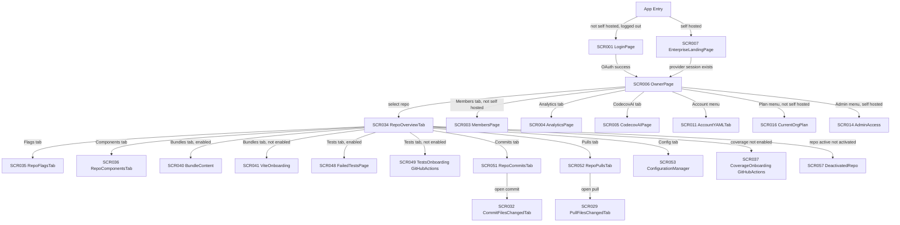
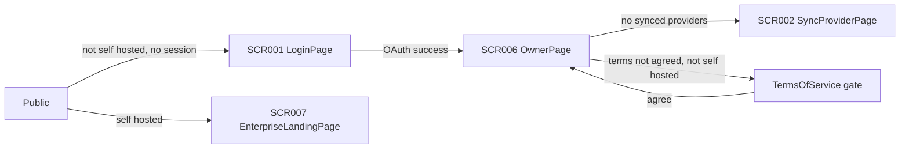

# Screen Flow

**Project**: Athena (Sun* self-hosted Codecov, frontend fork of codecov/gazebo)
**Generated**: 2026-09-08
**Analysis Scope**: FRONTEND-only SPA, screen_source route-view. Companion to screen-list.md (58 SCR, 8 REG). Mermaid labels below avoid unescaped parentheses/quotes (self-hosted noted as "self hosted", not "(self-hosted)").

**Code Format**: SCR###_NameSlug | SCR###/REG### for region-scoped transitions.

## Navigation Map



## Feature Entry Points

> Filled by the orchestrator from `feature-list.md` and `screen-list.md` after Wave 5.
> The template assigns this section to the FS.1 researchers of the `--feature-specs` pass,
> which a core-only run never dispatches; leaving the placeholder would ship an unresolved
> token. Entry screen = the lowest-numbered screen the feature owns.

### F001_AuthenticationAndOnboarding

- **Entry screen**: SCR001_LoginPage — `/login/:provider, /login`
- **Owned screens**:
  - SCR001_LoginPage — `/login/:provider, /login`
  - SCR002_SyncProviderPage — `/sync`
  - SCR007_EnterpriseLandingPage — `/ (self-hosted)`

### F002_DevMockServiceWorkerInfra

- **Entry screen**: none — this feature has no screen of its own.

### F003_RepoTabNavigation

- **Entry screen**: SCR034_RepoOverviewTab — `/:repo, /tree/:branch(+path), /blob/:ref/:path+`
- **Owned screens**:
  - SCR034_RepoOverviewTab — `/:repo, /tree/:branch(+path), /blob/:ref/:path+`
  - SCR040_BundleContent — `/:repo/bundles(/:branch)(/:bundle)`
  - SCR048_FailedTestsPage — `/:repo/tests(/:branch)`

### F004_RepoCoverageOverview

- **Entry screen**: SCR034_RepoOverviewTab — `/:repo, /tree/:branch(+path), /blob/:ref/:path+`
- **Owned screens**:
  - SCR034_RepoOverviewTab — `/:repo, /tree/:branch(+path), /blob/:ref/:path+`
  - SCR057_DeactivatedRepo — `/:repo, /:repo/bundles (deactivated state)`

### F005_BundleAnalysisDashboard

- **Entry screen**: SCR040_BundleContent — `/:repo/bundles(/:branch)(/:bundle)`
- **Owned screens**:
  - SCR040_BundleContent — `/:repo/bundles(/:branch)(/:bundle)`

### F006_TestAnalyticsDashboard

- **Entry screen**: SCR048_FailedTestsPage — `/:repo/tests(/:branch)`
- **Owned screens**:
  - SCR048_FailedTestsPage — `/:repo/tests(/:branch)`

### F007_RepoGeneralSettingsAndDangerZone

- **Entry screen**: SCR054_RepoGeneralTab — `/:repo/config/general`
- **Owned screens**:
  - SCR054_RepoGeneralTab — `/:repo/config/general`

### F008_RepoFlagCoverage

- **Entry screen**: SCR035_RepoFlagsTab — `/:repo/flags(/:branch)`
- **Owned screens**:
  - SCR035_RepoFlagsTab — `/:repo/flags(/:branch)`

### F009_RepoComponentCoverage

- **Entry screen**: SCR036_RepoComponentsTab — `/:repo/components(/:branch)`
- **Owned screens**:
  - SCR036_RepoComponentsTab — `/:repo/components(/:branch)`

### F010_RepoCommitsList

- **Entry screen**: SCR051_RepoCommitsTab — `/:repo/commits(/:branch)`
- **Owned screens**:
  - SCR051_RepoCommitsTab — `/:repo/commits(/:branch)`

### F011_RepoPullsList

- **Entry screen**: SCR052_RepoPullsTab — `/:repo/pulls`
- **Owned screens**:
  - SCR052_RepoPullsTab — `/:repo/pulls`

### F012_PullFilesChangedComparison

- **Entry screen**: SCR029_PullFilesChangedTab — `pull/:pullId`
- **Owned screens**:
  - SCR029_PullFilesChangedTab — `pull/:pullId`

### F013_PullFileDiffDetail

- **Entry screen**: SCR024_PullFileViewer — `pull/:pullId/blob/:path+`
- **Owned screens**:
  - SCR024_PullFileViewer — `pull/:pullId/blob/:path+`

### F014_CommitFilesChangedSummary

- **Entry screen**: SCR032_CommitFilesChangedTab — `commit/:commit`
- **Owned screens**:
  - SCR032_CommitFilesChangedTab — `commit/:commit`

### F015_CommitFileDiffDetail

- **Entry screen**: SCR031_CommitFileViewer — `commit/:commit/blob/:path+`
- **Owned screens**:
  - SCR031_CommitFileViewer — `commit/:commit/blob/:path+`

### F016_RepoConfigOverviewAndNavigation

- **Entry screen**: SCR053_ConfigurationManager — `/:repo/config`
- **Owned screens**:
  - SCR053_ConfigurationManager — `/:repo/config`
  - SCR058_NotFound — `unmatched-path fallback inside the account-settings and repo-config route switches (`src/pages/AccountSettings/AccountSettings.jsx:80`, `src/pages/RepoPage/ConfigTab/ConfigTab.tsx:65`); also rendered by the org-membership guard at `src/pages/RepoPage/ConfigTab/ConfigTab.tsx:32``

### F017_RepoYamlConfiguration

- **Entry screen**: SCR055_RepoYamlTab — `/:repo/config/yaml`
- **Owned screens**:
  - SCR055_RepoYamlTab — `/:repo/config/yaml`

### F018_OrganizationRepoList

- **Entry screen**: SCR006_OwnerPage — `/:provider/:owner`
- **Owned screens**:
  - SCR006_OwnerPage — `/:provider/:owner`

### F019_BillingAndPlanManagement

- **Entry screen**: SCR006_OwnerPage — `/:provider/:owner`
- **Owned screens**:
  - SCR006_OwnerPage — `/:provider/:owner`
  - SCR016_CurrentOrgPlan — `/plan/:provider/:owner`
  - SCR017_UpgradePlanPage — `/plan/:provider/:owner/upgrade`
  - SCR018_InvoicesPage — `/plan/:provider/:owner/invoices`
  - SCR019_InvoiceDetailsPage — `/plan/:provider/:owner/invoices/:id`
  - SCR020_DowngradePlan — `/plan/:provider/:owner/cancel/downgrade`
  - SCR021_TeamPlanSpecialOffer — `/plan/:provider/:owner/cancel`
  - SCR022_SpecialOffer — `/plan/:provider/:owner/cancel`

### F020_OrgAdminManagement

- **Entry screen**: SCR008_AccountProfile — `/account/:provider/:owner/`
- **Owned screens**:
  - SCR008_AccountProfile — `/account/:provider/:owner/`
  - SCR009_AccountAdminTab — `/account/:provider/:owner/`
  - SCR011_AccountYAMLTab — `/account/:provider/:owner/yaml/`

### F021_InstanceMemberManagement

- **Entry screen**: SCR015_AdminMembers — `/admin/:provider/users`
- **Owned screens**:
  - SCR015_AdminMembers — `/admin/:provider/users`

### F022_CoverageOnboarding

- **Entry screen**: SCR037_CoverageOnboardingGitHubActions — `/:repo/new`
- **Owned screens**:
  - SCR037_CoverageOnboardingGitHubActions — `/:repo/new`
  - SCR038_CoverageOnboardingCircleCI — `/:repo/new/circle-ci`
  - SCR039_CoverageOnboardingOtherCI — `/:repo/new/other-ci`

### F023_BundleOnboarding

- **Entry screen**: SCR041_ViteOnboarding — `/:repo/bundles/new`
- **Owned screens**:
  - SCR041_ViteOnboarding — `/:repo/bundles/new`
  - SCR042_RollupOnboarding — `/:repo/bundles/new/rollup`
  - SCR043_WebpackOnboarding — `/:repo/bundles/new/webpack`
  - SCR044_RemixOnboarding — `/:repo/bundles/new/remix-vite`
  - SCR045_NuxtOnboarding — `/:repo/bundles/new/nuxt`
  - SCR046_SolidStartOnboarding — `/:repo/bundles/new/solidstart`
  - SCR047_SvelteKitOnboarding — `/:repo/bundles/new/sveltekit`

### F024_TestAnalyticsOnboarding

- **Entry screen**: SCR049_TestsOnboardingGitHubActions — `/:repo/tests/new`
- **Owned screens**:
  - SCR049_TestsOnboardingGitHubActions — `/:repo/tests/new`
  - SCR050_CodecovCLI — `/:repo/tests/new/codecov-cli`

### F025_PullFileExplorer

- **Entry screen**: SCR023_PullFileExplorer — `pull/:pullId/tree/:path+, /tree/`
- **Owned screens**:
  - SCR023_PullFileExplorer — `pull/:pullId/tree/:path+, /tree/`
  - SCR024_PullFileViewer — `pull/:pullId/blob/:path+`

### F026_PullIndirectChanges

- **Entry screen**: SCR025_PullIndirectChangesTab — `pull/:pullId/indirect-changes`
- **Owned screens**:
  - SCR025_PullIndirectChangesTab — `pull/:pullId/indirect-changes`

### F027_PullCommitsList

- **Entry screen**: SCR026_PullCommitsTab — `pull/:pullId/commits`
- **Owned screens**:
  - SCR026_PullCommitsTab — `pull/:pullId/commits`
  - SCR032_CommitFilesChangedTab — `commit/:commit`

### F028_PullFlagsBreakdown

- **Entry screen**: SCR027_PullFlagsTab — `pull/:pullId/flags`
- **Owned screens**:
  - SCR027_PullFlagsTab — `pull/:pullId/flags`

### F029_PullComponentsBreakdown

- **Entry screen**: SCR028_PullComponentsTab — `pull/:pullId/components`
- **Owned screens**:
  - SCR028_PullComponentsTab — `pull/:pullId/components`

### F030_CommitFileExplorer

- **Entry screen**: SCR030_CommitFileExplorer — `commit/:commit/tree/:path+, /tree/`
- **Owned screens**:
  - SCR030_CommitFileExplorer — `commit/:commit/tree/:path+, /tree/`
  - SCR031_CommitFileViewer — `commit/:commit/blob/:path+`

### F031_CommitIndirectChanges

- **Entry screen**: SCR033_CommitIndirectChangesTab — `commit/:commit/indirect-changes`
- **Owned screens**:
  - SCR033_CommitIndirectChangesTab — `commit/:commit/indirect-changes`

### F032_BadgesAndGraphs

- **Entry screen**: SCR056_BadgesAndGraphsTab — `/:repo/config/badge`
- **Owned screens**:
  - SCR056_BadgesAndGraphsTab — `/:repo/config/badge`

### F033_OrganizationAnalytics

- **Entry screen**: SCR004_AnalyticsPage — `/analytics/:provider/:owner`
- **Owned screens**:
  - SCR004_AnalyticsPage — `/analytics/:provider/:owner`

### F034_OrgMembersActivation

- **Entry screen**: SCR003_MembersPage — `/members/:provider/:owner`
- **Owned screens**:
  - SCR003_MembersPage — `/members/:provider/:owner`

### F035_CodecovAIIntegration

- **Entry screen**: SCR005_CodecovAIPage — `/codecovai/:provider/:owner`
- **Owned screens**:
  - SCR005_CodecovAIPage — `/codecovai/:provider/:owner`

### F036_AccountProfileSettings

- **Entry screen**: SCR008_AccountProfile — `/account/:provider/:owner/`
- **Owned screens**:
  - SCR008_AccountProfile — `/account/:provider/:owner/`
  - SCR009_AccountAdminTab — `/account/:provider/:owner/`

### F037_OktaSSOConfiguration

- **Entry screen**: SCR010_OktaAccess — `/account/:provider/:owner/okta-access/`
- **Owned screens**:
  - SCR010_OktaAccess — `/account/:provider/:owner/okta-access/`

### F038_AccountDefaultYamlConfig

- **Entry screen**: SCR011_AccountYAMLTab — `/account/:provider/:owner/yaml/`
- **Owned screens**:
  - SCR011_AccountYAMLTab — `/account/:provider/:owner/yaml/`

### F039_PersonalAccessTokensAndSessions

- **Entry screen**: SCR012_AccountAccessTab — `/account/:provider/:owner/access/`
- **Owned screens**:
  - SCR012_AccountAccessTab — `/account/:provider/:owner/access/`

### F040_OrgUploadTokenManagement

- **Entry screen**: SCR013_OrgUploadToken — `/account/:provider/:owner/org-upload-token`
- **Owned screens**:
  - SCR013_OrgUploadToken — `/account/:provider/:owner/org-upload-token`

### F041_InstanceAdminAccessList

- **Entry screen**: SCR014_AdminAccess — `/admin/:provider/access`
- **Owned screens**:
  - SCR014_AdminAccess — `/admin/:provider/access`


---
## Screen Access Paths

| From Screen | To Screen | Action/Trigger | Conditions | Region |
|-------------|-----------|-----------------|------------|--------|
| Start | SCR001_LoginPage | Direct URL / logged-out redirect | `!config.IS_SELF_HOSTED` (`src/App.tsx:87,92`) | |
| Start | SCR007_EnterpriseLandingPage | Direct URL `/` | `config.IS_SELF_HOSTED` (`src/App.tsx:194-198`) | |
| SCR001_LoginPage | SCR006_OwnerPage | OAuth success | `HomePageRedirect` computes `/{provider}/{defaultOrg}` (`src/App.tsx:40-81`) | |
| SCR006_OwnerPage | SCR034_RepoOverviewTab | Click repo row | repo active + activated | |
| SCR006_OwnerPage | SCR003_MembersPage | Click Members tab | `!config.IS_SELF_HOSTED` | |
| SCR006_OwnerPage | SCR004_AnalyticsPage | Click Analytics tab | None | |
| SCR006_OwnerPage | SCR005_CodecovAIPage | Click CodecovAI tab | None | |
| SCR006_OwnerPage | SCR014_AdminAccess | Click Admin menu | `config.IS_SELF_HOSTED` | |
| SCR006_OwnerPage | SCR016_CurrentOrgPlan | Click Plan menu | `!config.IS_SELF_HOSTED` | |
| SCR006_OwnerPage | SCR011_AccountYAMLTab | Click Account menu | default account tab (`AccountSettings.jsx:53`) | |
| SCR034_RepoOverviewTab | SCR035_RepoFlagsTab | Click Flags tab | None | |
| SCR034_RepoOverviewTab | SCR036_RepoComponentsTab | Click Components tab | None | |
| SCR034_RepoOverviewTab | SCR040_BundleContent | Click Bundles tab | bundle analysis enabled | |
| SCR034_RepoOverviewTab | SCR041_ViteOnboarding | Click Bundles tab | bundle analysis not enabled + JS/TS present (`RepoPage.tsx:124-138`) | |
| SCR034_RepoOverviewTab | SCR048_FailedTestsPage | Click Tests tab | test analytics enabled | |
| SCR034_RepoOverviewTab | SCR049_TestsOnboardingGitHubActions | Click Tests tab | test analytics not enabled | |
| SCR034_RepoOverviewTab | SCR051_RepoCommitsTab | Click Commits tab | `productEnabled && userAuthorizedtoViewRepo` | |
| SCR034_RepoOverviewTab | SCR052_RepoPullsTab | Click Pulls tab | same gate | |
| SCR034_RepoOverviewTab | SCR053_ConfigurationManager | Click Config tab | None | |
| SCR034_RepoOverviewTab | SCR037_CoverageOnboardingGitHubActions | Redirect | coverage not enabled (`RepoPage.tsx:180-183`) | |
| SCR034_RepoOverviewTab | SCR057_DeactivatedRepo | Same route, state swap | `isRepoActive && !isRepoActivated` (`RepoPage.tsx:196-201`) | |
| SCR037_CoverageOnboardingGitHubActions | SCR038_CoverageOnboardingCircleCI | Click CI-provider radio | `NewRepoTab.tsx:111-112` | |
| SCR037_CoverageOnboardingGitHubActions | SCR039_CoverageOnboardingOtherCI | Click CI-provider radio | `NewRepoTab.tsx:114-116` | |
| SCR041_ViteOnboarding | SCR042_RollupOnboarding..SCR047_SvelteKitOnboarding | Click bundler radio | `BundleOnboarding.tsx:169-188` | |
| SCR049_TestsOnboardingGitHubActions | SCR050_CodecovCLI | Click setup-option radio | `FailedTestsTab.tsx:29-90` | |
| SCR040_BundleContent | SCR041_ViteOnboarding | Redirect | bundle analysis disabled after being enabled | |
| SCR048_FailedTestsPage | SCR048_FailedTestsPage/REG002 | Click test row | own scroll container | SCR048/REG002 |
| SCR053_ConfigurationManager | SCR054_RepoGeneralTab | Click sidebar link | None | |
| SCR053_ConfigurationManager | SCR055_RepoYamlTab | Click sidebar link | None | |
| SCR053_ConfigurationManager | SCR056_BadgesAndGraphsTab | Click sidebar link | None | |
| SCR053_ConfigurationManager | SCR058_NotFound | Unmatched `/config/*` path | `!currentOwner?.isCurrentUserPartOfOrg` (`ConfigTab.tsx:32,64-66`) | |
| SCR051_RepoCommitsTab | SCR032_CommitFilesChangedTab | Click commit row | None | |
| SCR030_CommitFileExplorer | SCR031_CommitFileViewer | Click file row | None | |
| SCR032_CommitFilesChangedTab | SCR030_CommitFileExplorer | Click tree tab | None | |
| SCR032_CommitFilesChangedTab | SCR033_CommitIndirectChangesTab | Click indirect-changes tab | `showIndirectChanges` | |
| SCR052_RepoPullsTab | SCR029_PullFilesChangedTab | Click pull row | None | |
| SCR023_PullFileExplorer | SCR024_PullFileViewer | Click file row | None | |
| SCR029_PullFilesChangedTab | SCR023_PullFileExplorer | Click tree tab | None | |
| SCR029_PullFilesChangedTab | SCR025_PullIndirectChangesTab | Click indirect-changes tab | None | |
| SCR029_PullFilesChangedTab | SCR026_PullCommitsTab | Click commits tab | None | |
| SCR029_PullFilesChangedTab | SCR027_PullFlagsTab | Click flags tab | None | |
| SCR029_PullFilesChangedTab | SCR028_PullComponentsTab | Click components tab | None | |
| SCR011_AccountYAMLTab | SCR008_AccountProfile | Click account-index (`/account/.../`) | `IS_SELF_HOSTED && isViewingPersonalSettings` | |
| SCR011_AccountYAMLTab | SCR009_AccountAdminTab | Click account-index | `!IS_SELF_HOSTED && isAdmin` | |
| SCR011_AccountYAMLTab | SCR010_OktaAccess | Click Okta-access sidebar link | `data.plan.isEnterprisePlan` | |
| SCR011_AccountYAMLTab | SCR012_AccountAccessTab | Click Access sidebar link | `!IS_SELF_HOSTED \|\| !HIDE_ACCESS_TAB` | |
| SCR011_AccountYAMLTab | SCR013_OrgUploadToken | Click org-upload-token link | admin only | |
| SCR012_AccountAccessTab | SCR058_NotFound | Unmatched `/account/.../*` path | none | |
| SCR014_AdminAccess | SCR015_AdminMembers | Click Users sidebar link | None | |
| SCR016_CurrentOrgPlan | SCR017_UpgradePlanPage | Click Upgrade | None | |
| SCR016_CurrentOrgPlan | SCR018_InvoicesPage | Click Invoices | None | |
| SCR018_InvoicesPage | SCR019_InvoiceDetailsPage | Click invoice row | None | |
| SCR016_CurrentOrgPlan | SCR021_TeamPlanSpecialOffer | Click Cancel plan | `showTeamSpecialOffer` | |
| SCR016_CurrentOrgPlan | SCR022_SpecialOffer | Click Cancel plan | `showSpecialOffer && !showTeamSpecialOffer` | |
| SCR016_CurrentOrgPlan | SCR020_DowngradePlan | Click Cancel plan | `!showCancelPage` (no discount/team offer applies) | |
| SCR021_TeamPlanSpecialOffer | SCR020_DowngradePlan | Click Continue to downgrade | None | |
| SCR022_SpecialOffer | SCR020_DowngradePlan | Click Continue to downgrade | None | |

## Screen Transitions

**Compaction note**: entry/exit points for all 58 screens are already fully captured, edge by edge, in Screen Access Paths above; this section adds only the family-level decision points not obvious from a flat edge list.

### SCR034_RepoOverviewTab family (RepoPage tab bar)
**Entry Points**: from SCR006_OwnerPage (repo row click); direct URL/bookmark.
**Exit Points**: to any sibling repo tab (SCR035, SCR036, SCR040/041, SCR048/049, SCR051, SCR052, SCR053) via the persistent RepoPage tab bar (`RepoPage.tsx:52-224`, not itself an SCR).
**Decision Points**: 3-way repo-state branch (`RepoPage.tsx:52-224`) - active+activated -> SCR034/035/036/040/048/051/052/053; active only -> SCR057_DeactivatedRepo (on `/:repo`, `/bundles`) with `/config`, `/new*`, `/tests*`, `/bundles/new*` still reachable; not active -> only `/new*`, `/tests*`, `/bundles/new*`, `/config` reachable, all else redirects to SCR037 (`RepoPage.tsx:203-224`).

### SCR008_AccountProfile / SCR009_AccountAdminTab (account-index variant swap)
**Entry Points**: from SCR006_OwnerPage Account menu; direct URL `/account/:provider/:owner/`.
**Exit Points**: to SCR010/SCR011/SCR012/SCR013 via AccountSettings sidebar (not itself an SCR).
**Decision Points**: `AccountSettings.jsx:48-53` - self-hosted+own-settings -> SCR008; non-self-hosted admin -> SCR009; else -> redirect to SCR011_AccountYAMLTab.

### SCR021_TeamPlanSpecialOffer / SCR022_SpecialOffer (cancel-flow variant swap)
**Entry Points**: from SCR016_CurrentOrgPlan "Cancel plan" action.
**Exit Points**: to SCR020_DowngradePlan (continue) or back to SCR016 (dismiss, not modeled as a route change).
**Decision Points**: `CancelPlanPage.tsx:45-51` - `showTeamSpecialOffer` -> SCR021; `showSpecialOffer` only -> SCR022; neither -> route never renders SCR021/022, goes straight to SCR020.

---

## Region Transitions

> Region transitions are client-state only (no URL change) except where noted.

| From Region | To Target | Action/Trigger | Client-State Only |
|-------------|-----------|-----------------|--------------------|
| SCR034_RepoOverviewTab/REG002 (CoverageChart) | SCR034_RepoOverviewTab/REG003 (Sunburst) | Toggle "Show charts" (`ToggleElement`, `OverviewTab.tsx:97-103`) | Yes |
| SCR034_RepoOverviewTab/REG004 (FileExplorer) | SCR034_RepoOverviewTab/REG004 (FileViewer) | Click file row in tree | No (URL changes: `/tree/...` -> `/blob/...`) |
| SCR040_BundleContent/REG001 (BundleChart) | SCR040_BundleContent/REG002 (AssetsTable) | Click a point on the bundle trend chart | No (URL changes: adds `/:bundle`) |
| SCR048_FailedTestsPage/REG001 (MetricsSection) | SCR048_FailedTestsPage/REG002 (FailedTestsTable) | Click a metric to filter the table | Yes |

---
## Authentication Flow



| Screen | Authentication Required | Authorization Level |
|--------|--------------------------|----------------------|
| SCR001_LoginPage | No (it is the login screen) | Public |
| SCR007_EnterpriseLandingPage | No | Public |
| SCR002_SyncProviderPage | Yes (internal-user session) | User |
| SCR006_OwnerPage and repo/pull/commit family (SCR023-SCR057) | Yes | User (org-scoped) |
| SCR014_AdminAccess, SCR015_AdminMembers | Yes | Self-hosted admin (`data?.isAdmin`, `AdminSettings.jsx:31`) |
| SCR009_AccountAdminTab, SCR013_OrgUploadToken (admin branch) | Yes | Org admin (`isAdmin`) |

---

## Error Handling Flows

| Screen | Error | Handling | Scope |
|--------|-------|----------|-------|
| SCR034_RepoOverviewTab | Repo not found | `RepoNotFoundErrorSchema` surfaces via query error boundary; `NetworkErrorBoundary` (`BaseLayout.tsx:9,116`) | screen |
| SCR034_RepoOverviewTab | Sunburst/file-count over limit | Sunburst region hidden, chart-only fallback (`OverviewTab.tsx:70-78`) | region:REG003 |
| SCR048_FailedTestsPage | Repo private + not activated | `ActivationAlert` shown instead of FailedTestsPage (`FailedTestsTab.tsx:138-141`) | screen |
| SCR053_ConfigurationManager family | User not org member | `NotFound` (SCR058) rendered inline (`ConfigTab.tsx:32`) | screen |
| SCR012_AccountAccessTab family | Unmatched account sub-path | `NotFound` (SCR058) via catch-all Switch route (`AccountSettings.jsx:79-81`) | screen |
| Any page under `BaseLayout` | Header/network fetch error | `SilentNetworkErrorWrapper` swallows header errors without blocking main content (`BaseLayout.tsx:101-111`) | region (header) |
| Any page under `BaseLayout` | Main-content render error | `ErrorBoundary` with `sentryScopes=[['layout','base']]` (`BaseLayout.tsx:115`) | screen |

---

## Circular Dependencies Check

- [x] No circular dependencies detected in the Navigation Map or Screen Access Paths above.
- [x] All screens have valid entry/exit points (either a parent-shell tab bar, a direct URL, or a redirect target).
- [x] All navigation paths terminate at a screen or an external action (no infinite redirect loop found - `HomePageRedirect`, `AdminSettings` non-admin redirect, and `CancelPlanPage` all resolve to a concrete SCR or stay put).

---
## Guard Logic

### GUARD-001 - IsSelfHosted redirect on non-self-hosted-only routes
**trigger:** inline JSX conditional in route table (react-router-dom v5 has no `canActivate`; this codebase gates by conditionally omitting/redirecting the route)
**source:** `src/App.tsx:87,92,105-132`
**logic:**
```pseudo
if (config.IS_SELF_HOSTED) {
  route("/login", "/login/:provider") -> redirect "/"
  route("/plan/:provider(/:owner)") -> omitted entirely (never registered)
  route("/members/:provider/:owner") -> omitted entirely
} else {
  route("/admin/:provider") -> omitted entirely
}
```
**failure path:** omitted routes fall through to the app-level `*` catch-all -> `HomePageRedirect`

### GUARD-002 - AdminSettings admin-only gate
**trigger:** inline conditional after a suspense query
**source:** `src/pages/AdminSettings/AdminSettings.jsx:29-58`
**logic:**
```pseudo
if (!data?.isAdmin && !isLoading) -> redirect "/{provider}"
```
**failure path:** redirect to `/{provider}` (SCR006_OwnerPage)

### GUARD-003 - useUserAccessGate (terms-of-service / sync interstitial)
**trigger:** hook evaluated on every `BaseLayout`-wrapped screen
**source:** `src/layouts/BaseLayout/hooks/useUserAccessGate.js:74-105`, consumed at `src/layouts/BaseLayout/BaseLayout.tsx:70-125`
**logic:**
```pseudo
if (internalUser.termsAgreement === false && !IS_SELF_HOSTED) -> render TermsOfService instead of children
else if (internalUser.owners.length === 0 && route != "/sync") -> redirect "/sync"
else -> render children (the requested screen)
```
**failure path:** neither redirect nor terms screen is a routed SCR (no distinct URL for TermsOfService); this is a content-swap gate in front of every screen under `BaseLayout`, not a route guard

### GUARD-004 - PlanPage / AdminSettings mutual self-hosted exclusion
**trigger:** inline conditional
**source:** `src/pages/PlanPage/PlanPage.tsx:57` (`if (config.IS_SELF_HOSTED || !ownerData?.isCurrentUserPartOfOrg) redirect`)
**logic:**
```pseudo
if (IS_SELF_HOSTED || !isCurrentUserPartOfOrg) -> redirect "/{provider}/{owner}"
```
**failure path:** redirect to SCR006_OwnerPage

---

## Deep-Link State Restoration

`N/A - no URL-driven UI-state restoration detected.` Every `useParams`/`useSearchParams` read in the codebase (branch, path, provider, owner, repo, pull id, commit sha) is consumed as the primary route param that already IS the screen's identity, not as a secondary UI-state restore (e.g. no `?sort=`/`?page=` filter-state rehydration was found on any of the 58 screens during this pass). This is a scope-bounded finding for Wave 2, not an exhaustive per-screen search of every query-string read; Wave 2b (BehaviorLogic) should re-check table/list screens (SCR029, SCR032, SCR035, SCR036, SCR048, SCR051, SCR052) specifically for pagination/sort query-params, since their `*Table` sub-components were not opened line-by-line in this pass.

---

## Unsaved-Changes Protection

`N/A - no unsaved-changes guards (beforeunload / route-leave guard / isDirty) detected` in the screens/components read for this artifact (SCR011_AccountYAMLTab's `YamlEditor`, SCR055_RepoYamlTab's `ValidateYaml`, and SCR054_RepoGeneralTab's danger-zone forms are the most likely candidates for this pattern but were not opened line-by-line in this pass - Wave 2b or a dedicated form-behavior pass should verify).

---

## Extraction Signatures

### Guard Logic
No `canActivate`/`beforeRouteEnter` framework hook exists in react-router-dom v5; guards in this codebase are plain conditional JSX/early-`return <Redirect>` inside the page component itself. Grep signature: `config.IS_SELF_HOSTED`, `isAdmin`, `<Redirect to=`.

### Deep-Link State Restoration
`useParams|useSearchParams|useLocationParams|URLSearchParams` - `src/services/navigation/useLocationParams.ts` is the shared query-string reader; grep its call sites for the definitive list.

### Unsaved-Changes Protection
`beforeunload|useBeforeUnload|isDirty|formState\.isDirty` - no hits found via the imports inspected in this pass; absence noted above as a gap for Wave 2b to re-verify against `YamlEditor`/`ValidateYaml`/danger-zone forms specifically.
