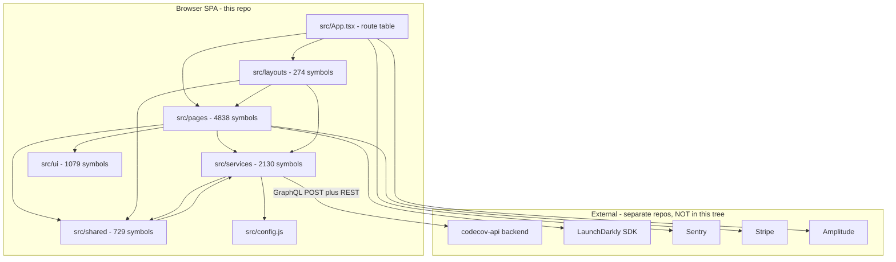
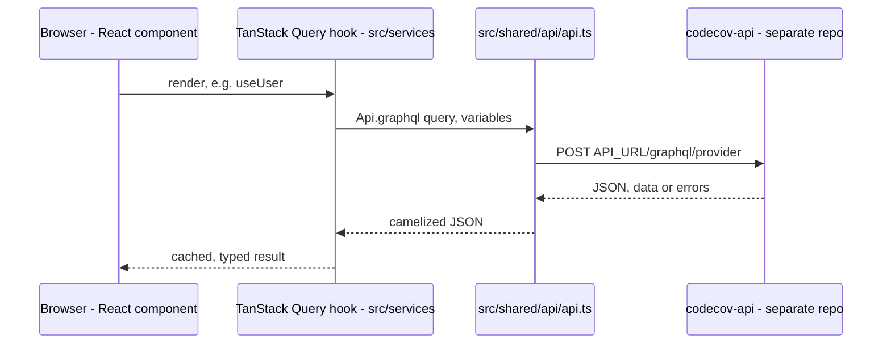
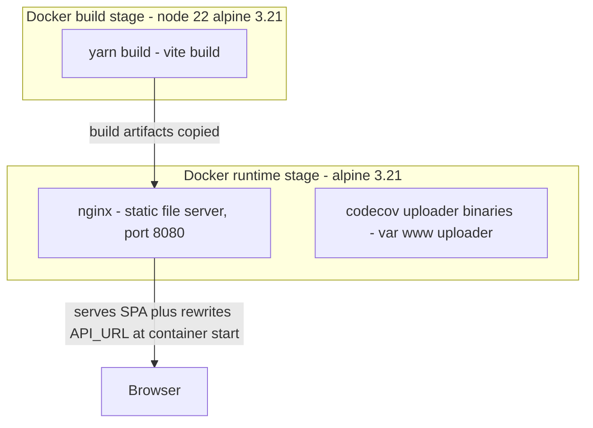

# Architecture

<!-- Wave 1 core artifact. Verified from plans/260908-1626-rebuild-spec/artifacts/_graph-drafts/architecture-draft.md
     (machine-derived module/import graph, 44 modules / 58 edges) plus direct source reads.
     Repo scope: FRONTEND ONLY (fork of codecov/gazebo). The codecov-api backend is a separate
     repo, not present in this tree -- every backend-side claim below is inferred from what the
     frontend calls, not verified against backend source. -->

## System Architecture

This is a single-page React application. There is no backend, gateway, or data layer in this
repository -- those live in the separate codecov-api repo. The diagram below is the verified
module graph for what actually exists in this tree: src/pages (screens) depends on
src/services (data-fetch hooks), src/ui (design-system primitives), and src/shared
(cross-cutting utilities); src/layouts wraps pages in chrome (header/sidebar/footer) and, in a
few cases, reaches back into page-owned context providers (a reverse edge, confirmed below).

**Source of the module edges:** plans/260908-1626-rebuild-spec/artifacts/_graph-drafts/architecture-draft.md:54-111 (aggregated import-edge counts). Spot-verified the counter-intuitive layouts to pages edge (src/layouts importing from src/pages) is real, not a graph artifact -- src/layouts/BaseLayout/BaseLayout.tsx:12-14 imports pages/OwnerPage/OnboardingContainerContext/context, pages/RepoPage/context, pages/TermsOfService; src/layouts/Header/components/Navigator/Navigator.tsx:3-4 imports pages/OwnerPage/hooks and pages/RepoPage/context. This is layouts pulling page-owned React Context providers/hooks that legitimately need app-wide scope (breadcrumbs, onboarding state) -- an architectural wart (layer inversion), not miswiring.

## Tech Stack

| Layer | Technology | Version | Source |
|-------|------------|---------|--------|
| UI framework | React | ^18.3.1 | package.json:76 |
| Language | TypeScript | ~5.7.3 | package.json:168 |
| Build tool | Vite (+ @vitejs/plugin-legacy, vite-tsconfig-paths, vite-plugin-svgr) | ^6.3.2 | package.json:169, vite.config.mjs:1-142 |
| Routing | react-router-dom v5 + react-router-dom-v5-compat (migration shim to v6-style APIs) | ^5.2.1 / ^6.15.0 | package.json:84-86; src/index.tsx:11-12 (CompatRouter) |
| Server-state cache | TanStack Query -- v4 (@tanstack/react-query) AND v5 aliased as @tanstack/react-queryV5, both mounted simultaneously (mid-migration) | ^4.29.5 / ^5.59.15 | package.json:48-49; src/index.tsx:51-94 (two QueryClient instances, two providers) |
| API protocol | GraphQL (primary, POST to /graphql/{provider}) + REST (GET/POST/PATCH/DELETE via fetch) | n/a | src/shared/api/api.ts:84-141 (graphql), :20-64 (REST _fetch) |
| Styling | Tailwind CSS + tailwind-merge + cva (class-variance-authority) | ^3.4.4 | package.json:89,55,166 |
| Forms | react-hook-form + zod + @hookform/resolvers | ^7.43.9 / ^3.21.4 | package.json:80,90,36 |
| Charts | recharts, d3-* (array/scale/shape/hierarchy/interpolate/transition) | ^2.15.3 / ^3.x | package.json:88,56-63 |
| Feature flags | LaunchDarkly (launchdarkly-react-client-sdk) | ^3.0.9 | package.json:69; src/shared/featureFlags/featureFlag.ts |
| Error/perf monitoring | Sentry (@sentry/react, @sentry/vite-plugin) | ^9.3.0 | package.json:45,98; src/sentry.ts; src/index.tsx:37,43 |
| Analytics | Amplitude (@amplitude/analytics-browser) | ^2.11.9 | package.json:34; src/services/events/ |
| Payments | Stripe (@stripe/react-stripe-js, @stripe/stripe-js) | ^3.1.1 / ^5.6.0 | package.json:46-47; src/stripe.ts |
| Test runner | Vitest + @testing-library/react + MSW (mock service worker) | ^2.1.9 | package.json:173,115,159 |
| Package manager | Yarn (Berry) | 4.9.1 | package.json:193 |
| Runtime | Node.js | >=22.11.0 | package.json:176 |
| Static-serve container | nginx (alpine) | 1.x (alpine 3.21 base) | docker/Dockerfile:62-103 |

**Notable dual-runtime state (not aspirational -- actively both live):** two React Query major
versions are mounted at once (src/index.tsx:51-94); two react-router styles coexist via a compat
shim (src/index.tsx:11-12). This is an in-flight migration, not a design choice to imitate.

## Data Flow

The frontend never talks to a database or queue directly -- it is a pure API consumer of
codecov-api (separate repo). All server-state reads/writes route through src/shared/api/api.ts,
wrapped by per-domain hooks in src/services/* that TanStack Query calls.

- GraphQL request construction and 403-triggered self-hosted redirect: src/shared/api/api.ts:84-137.
- REST request construction, snake/camel case conversion at the boundary: src/shared/api/api.ts:20-56 (snakeifyKeys/camelizeKeys).
- Representative consumer wiring useQuery around Api.graphql: src/services/user/useUser.ts:146,149.
- Query client config (staleTime 2 min, no refetch-on-focus, no retry on HTTP 429): src/index.tsx:49-94.

## Deployment View

> Derived from repository infrastructure-as-code -- not verified against production. This repo
> ships only a Docker image; the Helm chart/K8s manifests that deploy it live in a separate infra
> repo NOT present in this tree.

| Node / Edge | Description | Source |
|-------------|--------------|--------|
| BuildStage (node:22-alpine3.21) | Multi-stage build: yarn install && yarn build, strips mockServiceWorker.js from the production bundle | docker/Dockerfile:47-59 |
| Uploader stage | Separately downloads and GPG-verifies the codecov CLI uploader binaries (linux/macos/alpine/windows), bundled into the same image at /var/www/uploader | docker/Dockerfile:2-45,100 |
| Nginx runtime | Serves the Vite build output from /var/www/app/gazebo on port 8080, non-root user codecov (uid 1000) | docker/Dockerfile:62-102; docker/nginx.conf:34-81 |
| Nginx to Client | SPA fallback routing (try_files uri /index.html), gzip, cache headers for static assets, /frontend_health returns BUILD_VERSION BUILD_ID | docker/nginx.conf:44-79 |
| Runtime env substitution | start-nginx.sh rewrites baked-in api.codecov.io / codecov.io string literals inside the built JS bundle to CODECOV_API_HOST / CODECOV_BASE_HOST at container start -- i.e. the API origin is NOT purely a Vite-time env var, it is also patched post-build via sed on assets/*.js | docker/start-nginx.sh:19-33 |
| Optional GHE/GLE/BBS host injection | Same sed-based patch mechanism rewrites GitHub Enterprise / GitLab Enterprise / Bitbucket Server host placeholders when those env vars are set | docker/start-nginx.sh:22-33 |

**Degradation applied per template convention:** no docker-compose, Kubernetes manifest, Helm
chart, Terraform, or systemd unit exists in this repository (directory listing over the tree
confirms only docker/Dockerfile, docker/nginx.conf, docker/nginx-no-ipv6.conf, docker/start-nginx.sh,
docker/index.html, and .dockerignore at repo root -- no docker-compose.yml). **WARN:** actual
production topology (replicas, ingress, TLS termination, the Helm chart consuming this image) is
N/A -- no infrastructure-as-code found in repository for this scope; it lives in a separate infra
repo not available for this pass.

## Self-Hosted Gating (Athena / enterprise mode)

The single feature-flag mechanism gating self-hosted vs SaaS (codecov.io) behavior:

- **Gate source:** src/config.js:25-26 -- IS_SELF_HOSTED is derived at runtime from the ENV
  env var: keys['IS_SELF_HOSTED'] = keys['ENV'].toLowerCase() === 'enterprise'. Config is
  assembled from defaultConfig (src/config.js:5-17) overlaid by env vars stripped of the
  REACT_APP_ prefix (src/config.js:19-23), overlaid again by window.configEnv
  (src/config.js:74-78) -- meaning self-hosted deployments can also override config at
  serve-time via an injected global, independent of the nginx sed patch described above.
- **HIDE_ACCESS_TAB flag:** boolean-coerced at src/config.js:34-36; gates the Access tab in
  Account Settings only when self-hosted -- src/pages/AccountSettings/AccountSettings.jsx:64
  (condition: NOT self-hosted, OR NOT HIDE_ACCESS_TAB) and
  src/pages/AccountSettings/AccountSettingsSideMenu.jsx:19,47.
- **Other boolean flags in the same file:** SUNBURST_ENABLED (src/config.js:38-40),
  DISPLAY_SELF_HOSTED_EXPIRATION_BANNER (src/config.js:42-45), IS_DEDICATED_NAMESPACE
  (src/config.js:29-32) -- same coercion pattern, no additional HIDE_* flag beyond
  HIDE_ACCESS_TAB found in src/config.js.
- **Route-level gating** (self-hosted skips SaaS billing/member-management routes, adds an
  admin route): src/App.tsx:87,92 (login redirected to / when self-hosted),
  src/App.tsx:105-111 (/admin/:provider only mounted when self-hosted),
  src/App.tsx:112-132 (/plan/* and /members/* routes only mounted when NOT self-hosted),
  src/App.tsx:195-201 (root path renders EnterpriseLandingPage inside
  EnterpriseLoginLayout when self-hosted, else redirects to the owner home).
- **Widest fan-out of the flag:** 20+ additional call sites across src/ui/ContextSwitcher,
  src/shared/GlobalTopBanners/TrialBanner, src/shared/GlobalBanners/SelfHostedLicenseExpiration,
  src/shared/GlobalBanners/MissingDesignatedAdmins, src/shared/api/api.ts:123 (403 redirects
  to /login only when self-hosted), src/shared/ListRepo/ReposTable, src/layouts/Footer,
  src/layouts/shared/NetworkErrorBoundary, src/layouts/BaseLayout/hooks/useUserAccessGate.js,
  src/layouts/Header, and several src/pages billing/member screens -- confirming
  IS_SELF_HOSTED is the dominant runtime discriminator across the codebase, not a
  single-screen toggle. Not all 30+ sites are enumerated here to stay in scope (architecture-level
  claim only -- per-feature gating detail belongs in the Permissions/feature-spec artifacts).

## Limits of this pass

- Backend behavior (what codecov-api actually does with each GraphQL/REST call) is not
  verified -- it lives in a separate repository outside this worktree. Every backend-side arrow
  in the diagrams above is an inference from the frontend call shape, not a read of server code.
- Production deployment topology (replicas, ingress/TLS, the Helm chart) is out of scope per the
  task's hard rule -- documented as N/A with source citations for what is present (docker/).
- The full self-hosted-flag call-site list is not exhaustively enumerated (30+ sites found via
  grep); this document cites the gating mechanism and a representative, verified sample sufficient
  to establish the architectural pattern. A complete site-by-site enumeration belongs in
  feature-specs/permissions artifacts, not here (YAGNI for a core architecture doc).
- Did not independently re-derive the 58-edge import graph from raw source -- spot-checked one
  counter-intuitive edge (layouts to pages) and one representative data-flow hook (useUser); the
  remaining edges are taken on the graph tool's authority per the task's explicit instruction not
  to re-derive it.
